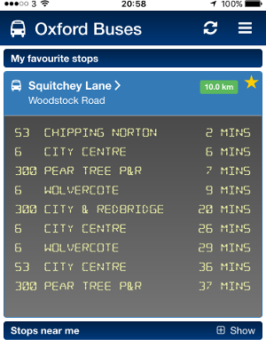
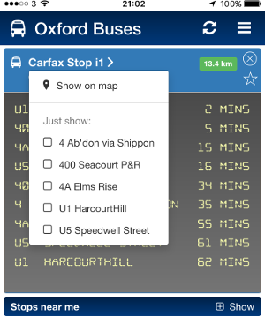

Oxford Bus Times
================

This is an experimental mobile web application designed to make realtime Oxford bus data accessible on your smartphone in a useful manner.

A Realtime Information Service (RTI) for Oxford buses is already made available by Oxford County Council via the http://www.oxontime.com website and via bus stop SMS shortcodes. The RTI service publishes predicted arrival times of buses on the website and shortcodes by using live GPS data from buses as they travel around.

Whilst the website and shortcode mechanisms are functional, they don't make use of some of the more modern technologies available in today's smartphones - such as geolocation.

The aim of the Oxford Bus Times mobile web application is to take the existing realtime data and use geolocation and a modern user interface to create a useful, user-friendly experience which is accessible to you whilst on the move.

Features
========

Stops near me
--------------

When you first open the app it will attempt to locate the bus stops nearest to you and display the latest arrival times of each service. Stops are displayed with the distance from your current location and arrival times automatically update every few seconds.

    

Stop search
-----------

If you're interested in the bus times at a specific stop which isn't near to you, then you can search for that stop by its name.

Favourite stops
---------------

If there are stops that you regularly visit, to get to and from work for example, then you can star those stops so they appear in the favourites section. This means that they will always be visible showing the latest times no matter where you are. You can even hide the nearest stops to reduce the clutter on the screen.

Filtering your view
-------------------

For busy stops that support a number of different bus services, you can tap the stop name to bring up a menu where you can filter the services you're interested in.

Technologies
============

The Oxford Bus Times web application is developed in AngularJS with a Python/Flask backend running in Heroku. The backend is primarily responsible for performing stop lookups using data received from the UI. Communication with the backend is JSON over HTTP.

Compatibility
=============

The web application should run in most web browsers but is specifically designed for smartphones and has been tested almost exclusively on the iPhone.

The backend uses the free Heroku dyno which can take a few seconds to come alive. This means that the application can take a while to display anything when it is first launched and you may just see a blank screen for the first 10 seconds or so.

Accessing
=========

To access the web application, just navigate to the following URL on your device.

https://tranquil-tor-1255.herokuapp.com

Authors
=======

Will Keeling